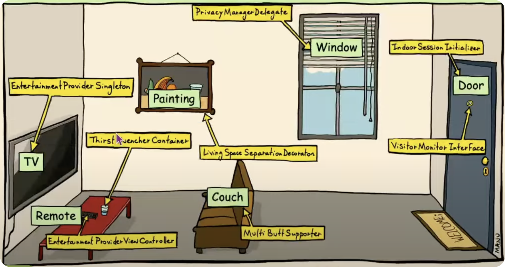

# Code Smells Hall of Fame

---
transition: fade-out
---

#  Kick-off Quiz
- Method length < **20** lines of code
- Method depth < **3** indentation levels
- File length < **200** lines
- Feeling about //comments in code: **not required by good code**
- we see duplicated code: **extract a shared method**
- To work with collections, instead of a for loop, use: **.map / .filter**
- Feeling about setters: **avoid - prefer immutable objects!**
- Formatting: `for (var e: list )` **auto-format by IDE**

---
transition: fade
---

# Copy-Paste Programming
- DRY
  - Don't Repeat Yourself
  
---

# Too DRY
- Removing duplication too aggressively can:
  - **Increase complexity**: `godMethod(a, b, c, d, false, true, -1, (x,y) -> ...)`
  - **Increase coupling**: method uses 10 dependencies
  - Abuse **inheritance**: class Green extends Color extends Base extends
    - **Accidental Coupling**: of unrelated flows with similar code
- **Only unify code that changes together** → ask PO
- **The rule of 3**: **a little** repetition is better than the **wrong abstractions**

---

# There are only two things hard in programming ...
1) cache invalidation
2) naming things
- A good name proves it does one clear thing - **SRP**

---

# Bad Names
- `dr` //  mysterious acronym
- `-> {... 20 lines of code }` // **anonymous** logic
- `updatePlace(player, ..);` // purely technical lacks intent
- `MovieType priceCode;` // synonyms confuse
- CQS 위반
  - `checkCustomer(customer);` // updating customer
  - `price = computePrice(..);` // INSERT in DB?!

---

# Names with bad Signal/ Noise ratio
- Use simple memorable names from the problem domain


<!--  -->

---

# Rename
- Continuous Distilation
---

# Stuff That Starts Small...
- 5 lines of code
- then 7, 10, 15, 25, 45..
---

# Bloaters
---
layout: two-cols
---

## Monster Method
- `> 20 lines`
- `depth > 3`
- The more complex, the shorter
- Same Level of Abstraction (SLAb)

::right::

## God Class
- `> 200 lines`
- → Split in High / Low level
- → Split in Flow A / Flow B

---
layout: two-cols
---

## Many Parameters
- `> 4`
- → Split method by SRP
- → Extract reusable Parameter Object
  - also: `Generics<A,B, U,S,E>`

::right::

## Complex Lambda
- The magic number 7 +/- 2
- How many things the human brain can keep in working memory
  - max 7 ideas/method 
  - max 7 methods/class
- Extract if you can find a good name

---

# When in Doubt, Extract a Method

---

# Missing Type

- String, int, int, String 등이 흩어져 있을 때
- related data elements moving around together
- Create more classes to group data that sticks together
- aka:
  - Data Clumps
  - Missing Abstraction

---

# Missing Type

- Ex.
  - `int, int` → `Interval(start, end)`
  - `{"amount":10, "cur": "EUR"}` →  `Money{amount,currency}`
  - `Tuple4<String, Long, Long, Date>` → `PricedProduct`
  - `Map<Long, List<Long>>` → `List<CustomerOrders>`
  
---

# Discover New Classes
- `Interval (start, end)` → **Simplify Code**
  - Less Parameters: `in(x, Interval)`
  - Shrink Entities: `carModel.years:Interval`
  - If Objects, not only a Data Structure
    - Host Bits of Behavior: `interval.intersects(...)`
    - _Guard_ **Constraints**: `start < end`
- 이런게 **객체지향**임

---

# Util & Helper
- Collect Selectively
  - PDFHelper
  - DBUtils
  - DateUtils
  - StringUtils
- util은 거대해 진다. 분리 수거를 해야 한다.

---

# Feature Envy
- Logic using the state of another object
```java
int place = player.getPlace() + roll;
if (place > 12) {
    place -= 12;
}
player.setPlace(place);
```

- Keep behavior next to state (OOP)
  - `player.advance(roll);`

---
  
# Data Classes

- Anemic class with fields, but no behavior
- **Rich Objects** with logic & constraints help simplify core logic

---

# Middle Man
- **Indirection without abstraction**
```java
int startYear() {
  return yearInterval.start();
}

public Customer findById(id) {
  return repo.findById(id);
}
```

- **NOISE**
- Inline Method... 

---

# Micro-Types
- Fight the **Primitive Obsession** by creating Micro-Types

  `void redeemCoupon(Long couponId, Long customerId, String email)`

- Type-safe semantics

  `void redeemCoupon (CustomerId customer, CouponId cupon, Email email)`

- 이렇게 작은 타입을 만들고 관련된 행위를 Util이 아니라 타입에 내재화
- early decision

---

# FUNCTIONAL PROGRAMMING In our daily life:
1) Pass behavior around `f(x → ...)`
- ~~`f(new Consumer<X>() { void accept(xx) {...} })`~~
- Functions are first-class citizens
2) Simplify work with collections
- `newList=list.stream().filter(→).map(→).toList();`
- with Less mutation: ~~add, remove..~~

---

# Philosophy of FUNCTIONAL PROGRAMMING
- = PROGRAMMING WITHOUT SIDE EFFECTS
- Functions should be **pure**
  - No **Side Effects**
  - Same **input** → Same **output**
- Data should be **immutable**

---

# Long-Lived Mutable Data
- in complex flows = hard to track changes
- in multi-threaded code = race bugs
- → **Immutable Objects**
- if mixed with an ORM: **Cumbersome**
- if designed too large: **Fragmented Immutable**
- if cloned repeatedly: **Memory Churn**

---

# Fragmented Immutable >> Builder
- Ugly large constructor
  `x = new X(1, 2, 3, false, -1, null, "X");`
- .toBuilder() allows **unrestricted changes**
  `var obj2 = obj1.toBuilder().a(1).b(2)...build();`
---

# Fragmented Immutable >> Builder
- Meaningful methods, that may guard rules 
  ```java
  builder.fullName ("First", "Last")... // manual builder
  var obj2 = obj1.withFullName("First", "Last"); // wither
  ```
- Deeper model (new types)
  `var obj2 = obj1.withFullName(new FullName("F", "L"));`
- named parameter가 있는 언어는 builder가 불필요
- 특히 lombok으로 만든 builder는 아무거나 변경 가능함

---

# Don't reassign local variables
- **for is as Code Smells**
  - if it does more than one thing
  - if it can be replaced with FP: `.filter, .map`...
---

# Complex Loop 
- doing unrelated things
- **Split Loop**
```java
for (e : list) {
    results.add(...);
    total += ...;
    sideEffect(e);
｝
```
- 3개의 루프로 분리

---

# Accumulator Loop
- gathering data via a loop
  - 외부에서 컬렉션을 선언하고 루프에서 누적하는 것은 안티패턴
  - 스트림으로 변경해야

```java
var results = new ArrayList();
for(e : list) {
    results.add(...);
}
```

- → `var results = list.stream()....collect(...);`

---

# Accumulator Loop

```java
for(e : list) {
 total += ...;
}
```

- → `var total = list.stream()....sum();`

```java
for(e : list) {
 sideEffect(e);
}
```

- → `list.forEach(e -> sideEffect(e));`

---

# Mutant Pipeline
- avoidable **side-effects** in a FP pipe

```java
// TODO: sum active orders
int total = 0;
orders.stream()
    .filter(order → order.isActive())
    •forEach(order → {
        total += order.getPrice();
    });
```

- compile error
  - lambdas can't change variables on stack
  
---

# Mutant Pipeline
- Hack
  - move mutable state on heap

```java
// AtomicInteger total;
total.incrementAndGet(price);

// int[] sum = {0};
total[0] += price;

this.total += price; // fieldO
```
  
---

# Mutant Pipeline

- Correct
  - compute and return

```java
int total = orders.stream()
        .filter(Order::isActive)
        .mapToInt(Order::getPrice)
        .sum();
```

~~`.reduce(0, Integer::sum); // avoid`~~
---

# Mutant Pipeline
- avoidable **side-effects** in a FP pipe

```java
stream.forEach(e -> ...)
optional.ifPresent(e -> ...)
```

- **Code smells** when used to accumulate data:

```java
.forEach(e -> map.put(e.id(), e)); → .collect(toMap())
.forEach(e -> adder.increment(e)); → .sum ()
.ifPresent(e -> list.add(e)); → .flatMap(Optional::stream)
```

- OK to do external side effects:

```java
.forEach(m → mailSender.send (m)); // external call
.forEach(e → e.setStartedAt(now()));
.ifPresent(e → repo. save(e));
```
---

# Key Point
- Avoid side-effects in .forEach (if possible)
- Side-effects are bad
  - (but often necessary)
---

# Functional Programming
- Misuse > Abuse
---

# Functional Chainsaw
```java {lines:true, maxHeight:'50px'}
List<Product> streamWreck(List<Order> orders) {
    return orders.stream() 
        .filter(o -> o.getCreationDate().isAfter(now().minusYears(1)))
        // Order::isRecent, orderedProducts()
        .flatMap(o -> o.getOrderLines).stream())
        .collect(groupingBy(OrderLine::getProduct,
          summingInt(OrderLine:: getItemCount))) // → extract explanatory variables and functions after every ~ 3-4 operators
        .entrySet()
        .stream()
        .filter(e -> e.getValue() >= 10)
        .map(Entry::getKey)
        .filter(p -> !p.isDeleted())
        .filter(p -> !productRepo.findByHiddenTrue().contains(p))
        .collect(toList());
```
- magic number(7 +/- 2)를 기억하라
---

# Reduce Rodeo
- Complex folding

```typescript
return list.reduce((prev, e) => // TypeScript
  new Dec (prev?.price || 0).gte(e.price || 0) ? prev : e, undefined);
```

- Prep the collection
  - using .filter() .map() and keep reduce trivial
  
  ```typescript
  const maxByPrice = (a, b) => new Dec(a.price).gte(b.price) ? a : b;
  return list.filter(({price}) => !!price).reduce(maxByPrice);
  ```

---

# Reduce Rodeo

  - Use specialized collectors
     - `.sum () .toList() .max() .average()`
    - Use reduce for:
     - a) unusual accumulation
     - b) compute multiple results eg max+min in a single pass
     - c) performance (measured)
     - d) JS/TS, kept simple
---

# Juniors are ... Seniors can't ...
- Juniors are eager to write more code (to learn and experiment)
- Seniors can't wait to delete it ( code hurts )
---

# Overengineering aka Speculative Generality
- Keep It Short & Simple (KISS)
- Ever wrote code **anticipating** a future **requirement**, or a **hoping a wider use** (eg. a shared library)?
- Yes!
  - a **bright developer**
> Nothing is more difficult than finding a simple solution to a complex problem.
> Simplicity is the ultimate sophistication. - Leonardo DaVinci
- But it's fun!! : Pet-project!
---

# Code Smells
- General
  - Bad Names
  - Monster Method
  - God Class
  - Flags
  - Many Parameters
  - Complex Loop
  - Repeated Switches
---

# Code Smells
- OOP
  - missing abstraction(== missing type)
  - Feature Envy  
  - Data Classes  
  - Middle Man  
  - Primitive Obsession  
---

# Code Smells
- FP
  - Accumulators
  - Imperative FP
  - Heavy Lambda
  - Reduce Rodeo
  - FP Chainsaw
  - Mutable Data
  - Temporary Field
  - Confused Variable
---

# Reference
- [VDBUH2024 - Victor Rentea - Code Smells - Hall of Fame](https://www.youtube.com/watch?v=lsW0-sEGr3w&list=WL&index=26)
